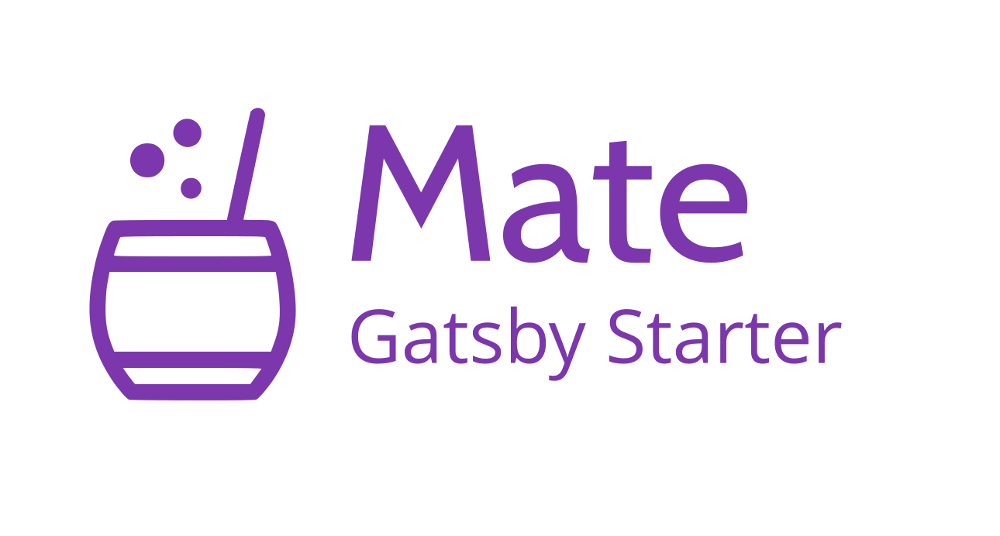
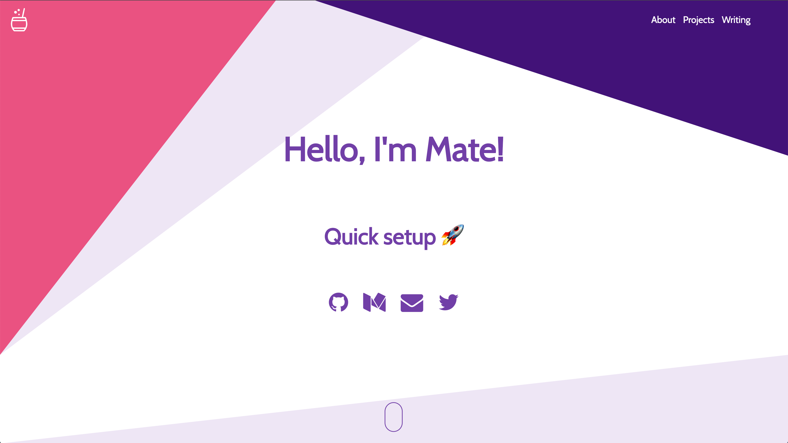
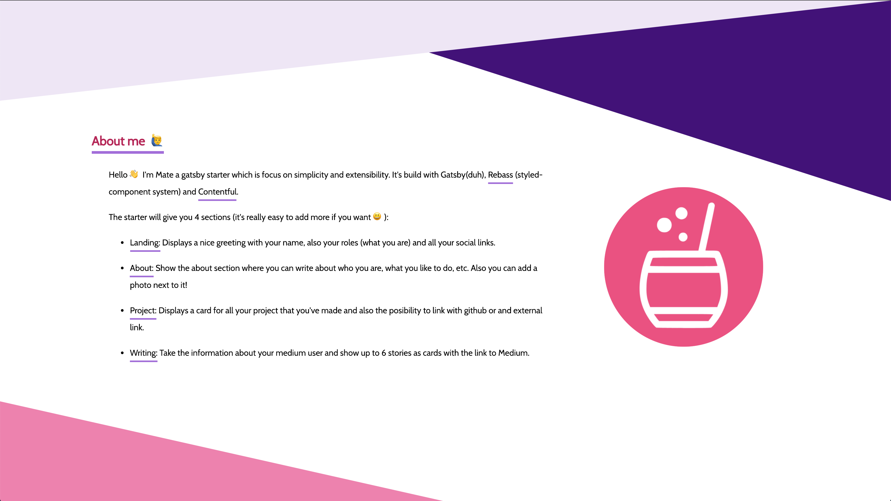
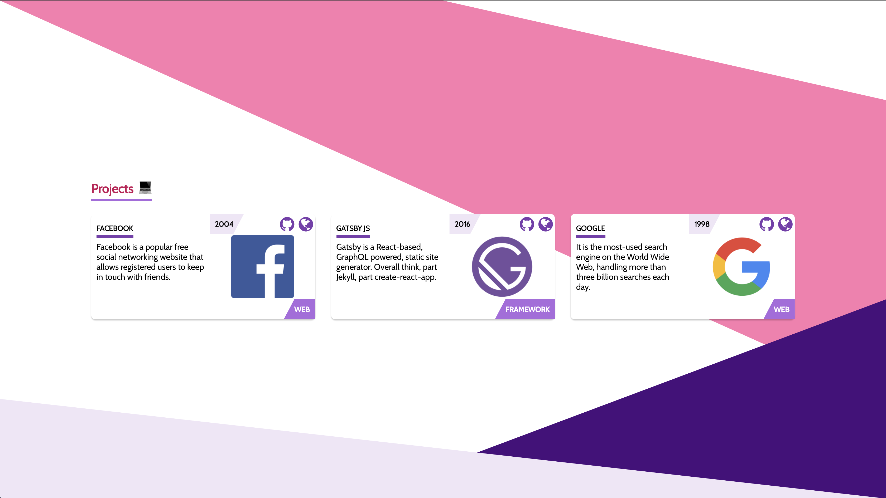
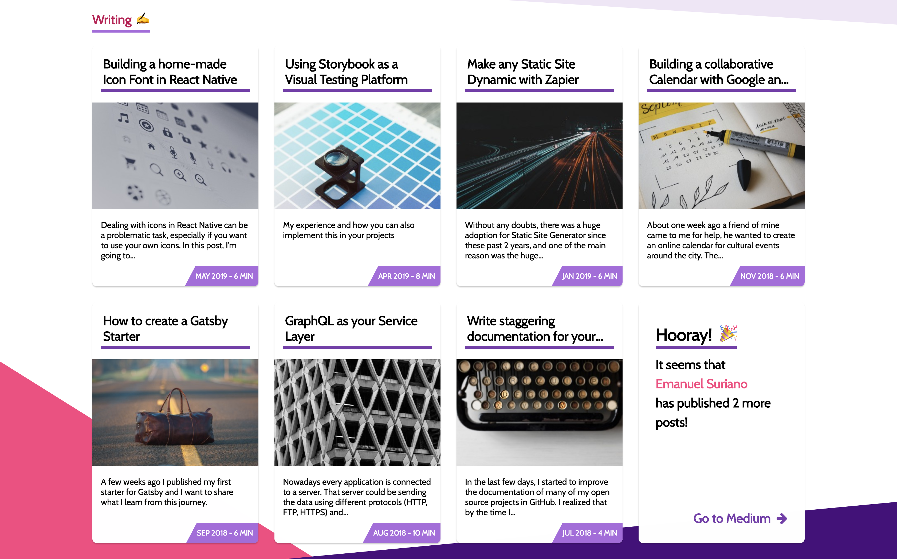
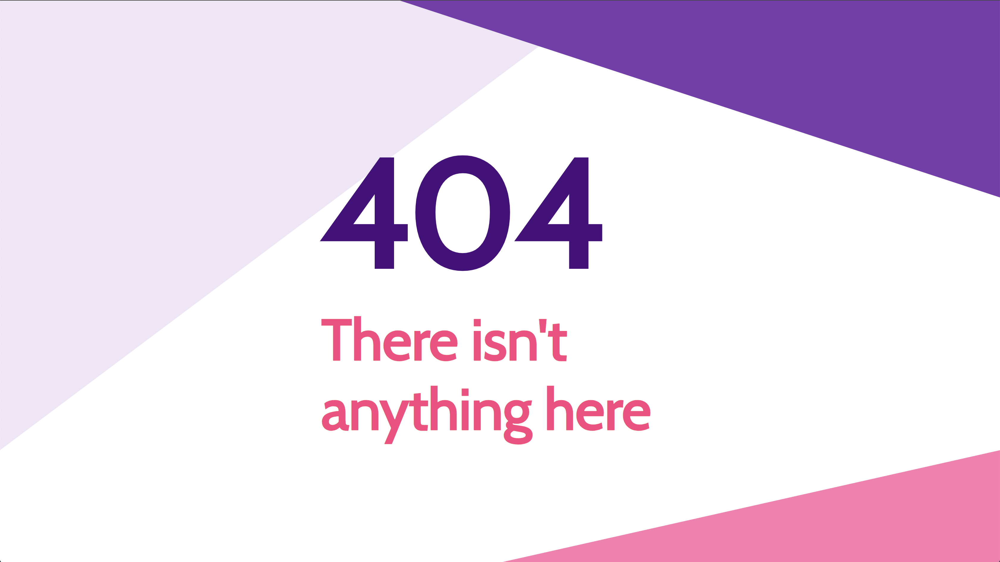
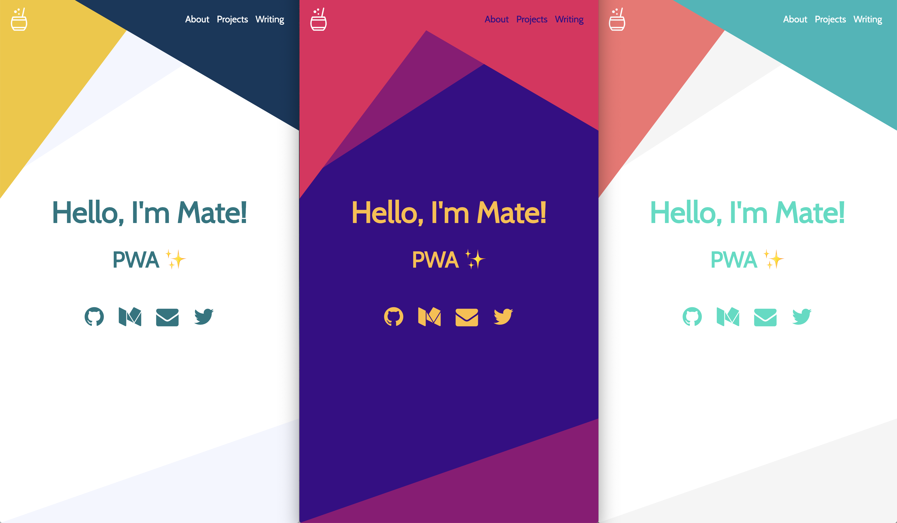
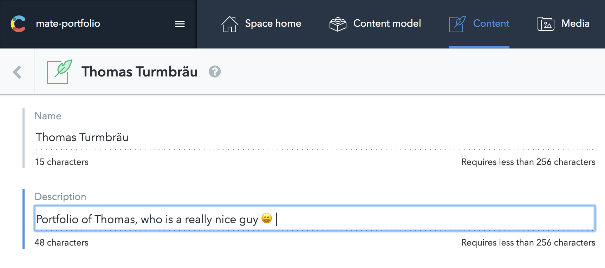

# Gatsby Starter: Mate

[](https://travis-ci.com/EmaSuriano/gatsby-starter-mate)
[](https://eslint.org/)
[](https://github.com/prettier/prettier)

[](https://percy.io/Ema-suriano/gatsby-starter-mate)
[](https://app.netlify.com/sites/gatsby-starter-mate/deploys)



> An accessible and fast portfolio starter for Gatsby integrated with Contentful CMS.

The target audience are Developers 💻 and Tech Writers ✍️.

### [Check the Demo ✨](https://gatsby-starter-mate.netlify.com/)

<a href="https://www.buymeacoffee.com/emasuriano" target="_blank"></a>

## Why? 🤔

In case you are looking for a quick setup portfolio or upgrade your current, you have to definitely try Mate!

This starter is totally content based on [Contentful](https://contentful.com), which is a headless CMS where you can write the content for your page. In summary, Contentful is the Model when Gatsby with React is the View.

At the same time, as this portfolio is written with Gatsby is extremely easy to add more than one source of data! For example, the demo comes with an integration of [Medium](https://medium.com) posts based on a user name ✌️

## Features 🛠

- [Gatsby v2](https://www.gatsbyjs.org/)
- [Rebass 3.0 🎉](https://rebassjs.org/): styled component system
- [React Reveal](https://www.react-reveal.com/)
- Dynamic content from [Contentful](https://contentful.com)
- Offline support
- PWA ready
- SEO
- Responsive design
- Icons from [font-awesome](https://fontawesome.com/)
- [Netlify](https://www.netlify.com) Deployment Friendly
- Medium integration
- Social sharing (Twitter, Facebook, Google, LinkedIn)
- Developer tools:
  - `eslint`
  - `prettier`
- Google Analytics integration
- End to End with Cypress:
  - A11y testing with [Axe](https://www.deque.com/axe/)
  - Visual Testing with [Percy](https://percy.io/)

### Lighthouse Score 💯


## How to start ▶️

This is because you didn't specify from which `Contentful` space the portfolio will take the information. So the next step is create an empty space in [Contentful](https://www.contentful.com/)!

After the space is created, run the following command:

```bash
yarn setup
```

This CLI will request 3 values:

- `Space ID`
- `Content Delivery API - access token`
- `Personal Access Token`

These 3 values are inside the Settings section --> API keys.

After you provide them the CLI will automatically starts copying all the `Content models` and `Contents` from `mate-demo-contentful` to your space ✨

If everything went smooth you should see something like this in your terminal:

```text
Writing config file...
Config file /Users/my-user/Git/test/mate-portfolio/.env written
┌──────────────────────────────────────────────────┐
│ The following entities are going to be imported: │
├─────────────────────────────────┬────────────────┤
│ Content Types                   │ 3              │
├─────────────────────────────────┼────────────────┤
│ Editor Interfaces               │ 3              │
├─────────────────────────────────┼────────────────┤
│ Entries                         │ 8              │
├─────────────────────────────────┼────────────────┤
│ Assets                          │ 6              │
├─────────────────────────────────┼────────────────┤
│ Locales                         │ 1              │
├─────────────────────────────────┼────────────────┤
│ Webhooks                        │ 0              │
└─────────────────────────────────┴────────────────┘
 ✔ Validating content-file
 ✔ Initialize client (1s)
 ✔ Checking if destination space already has any content and retrieving it (2s)
 ✔ Apply transformations to source data (1s)
 ✔ Push content to destination space
   ✔ Connecting to space (1s)
   ✔ Importing Locales (1s)
   ✔ Importing Content Types (4s)
   ✔ Publishing Content Types (3s)
   ✔ Importing Editor Interfaces (3s)
   ✔ Importing Assets (7s)
   ✔ Publishing Assets (3s)
   ✔ Archiving Assets (1s)
   ✔ Importing Content Entries (1s)
   ✔ Publishing Content Entries (5s)
   ✔ Archiving Entries (1s)
   ✔ Creating Web Hooks (0s)
Finished importing all data
```

After this step we can finally run the project and see the result in http://localhost:8000/ 😃

```bash
$ yarn start
```

## Screenshot and Design 🖼

As the starter is a SPA it only has two routes:

- `/`: main page with the sections of `Home`, `About me`, `Projects` and `Writing`.
- `/404`: error page for unexpected route.

| Section  |           Screenshot            |
| -------- | :-----------------------------: |
| Home     |          |
| About me |     |
| Projects |  |
| Writing  |    |
| /404     |            |

## Theming 🎨

This starters come with a hand-made color palette made by myself, but I highly encourage you to go and customize the colors to match your preference! The colors can be found inside [`colors.js`](./colors.js), which are going to be loaded by `ThemeProvider` of `styled-components` and apply across all the components inside the application.

Some examples I made by using palettes from [Color Hunt](https://colorhunt.co/):



## Building your site 📦

As we are dealing with environment variables, the `.env` file is excluded from `.gitignore` file. Therefore, in order to deploy the website you have to send `SPACE_ID` and `ACCESS_TOKEN` with the `build` command.

```bash
SPACE_ID=xxxxx ACCESS_TOKEN=yyyyy yarn build
```

The result will be stored inside the `public` folder, so you can upload to your web host. I highly suggest using this starter with Netlify when you can define which command will build the project and also send the environment variables inside the website configuration.

## Adding your information 📝

All the text of this starter live inside Contentful, specifically inside the Content of `About`. In order to change it, just go to `Content` section and change the entity of About with the information you want.



Regarding the projects and social links the process is the same! Contentful is really easy to learn so don't be afraid of breaking everything, remember that you can restore to the start point by running `yarn setup` 😄

## End to End Testing with Cypress 🧪

The starter comes with a built in End to End Setup using Cypress. As there are no complex logic flow, there are only two tests in place:

1. Accessibility check: using the [cypress-axe](https://www.npmjs.com/package/cypress-axe) plugin you can easily check a lot of a11y rules at once powered by [Axe](https://www.deque.com/axe/)!
2. Visual testing: using [percy-cypress](https://github.com/percy/percy-cypress) plugin you can take screenshot with different resolutions and easily the difference inside their platform. 

### Setting Visual Testing for your project (Optional) 📸

By default, the visual testing will fail due to Percy needs a Token in order to know with which project of your account is related. The steps to set up your own visual testing workflow is:

- Create a project in [Percy](https://percy.io/).
- Go to "Project settings" -> "Project token" and copy the whole line saying "PERCY_TOKEN=<YOUR_TOKEN>".
- Open the `.env` file located in the root of the project and add the token to your credentials.
- Try running `yarn e2e:ci` and you should be able to see a new build inside your Project Dashboard in Percy.

## Configuration (Optional) 👷‍♂️

Mate starter is a SPA (Single Page Application), so basically you have only two pages:

- `Main.js`: portfolio itself
- `404.js`: 404 error page with the same style

The structure for the main page is the following:

```javascript
<Layout>
  <Landing />
  <About />
  <Projects />
  <Writing />
</Layout>
```

`Layout` is the core of the application, it manages the theme for the application, the navigation between sections, also it defines the `header`.

All the components inside `Layout` are `Section` components. A section can have a link inside the `Header` or not, in order to add you need to wrapped the exported `Section` with `withNavigation` HOC and it will be automatically registered (Context magic ✨).

## Tracking with Google Analytics (Optional) 📈

This starter has the analytics plugin inside the `gatsby-config`, so the only need to do in order to enable it is to provide the `Tracking Id` for your site (starts with `UA-`). Just set a new variable inside your `.env` file called `ANALYTICS_ID` and analytics will be turn on automatically.


## License

MIT.
